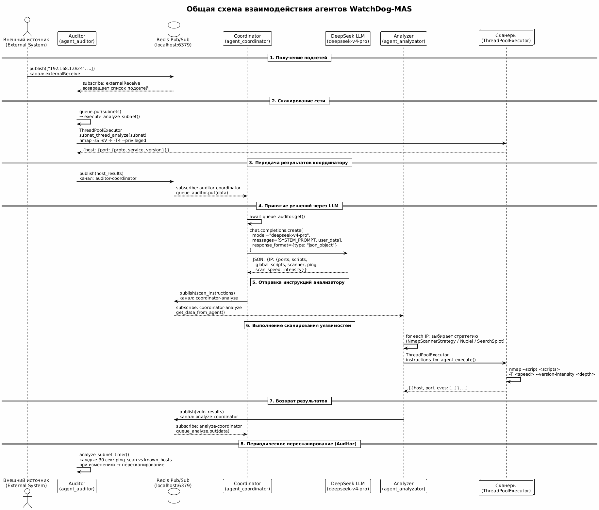

# WatchDog-MAS
<div align="center">
  
</div>  
> A multi-agent system for network vulnerability analysis. Three autonomous agents — **Auditor**, **Coordinator**, and **Analyzer** — work together to discover, plan, and perform security scans, coordinated through a Django web application.


</div>

## Overview

**WatchDog-MAS** ("watchdogs") is a multi-agent system for analyzing network segments for vulnerabilities. It is primarily aimed at LAN networks, but global/internet segments are supported as well.

The name reflects the design: the system is split into **three agents**, each performing its own role. Rather than a one-click black box, WatchDog-MAS is a thin, transparent orchestration layer over well-known security tools. It automates familiar scanning scenarios to speed up the analyst's work, while still allowing fine-grained tuning of every agent.

### Why a multi-agent architecture?

The multi-agent design was chosen for its distinctive properties:

- **Autonomy** — each agent is independent and can run and scale on its own.
- **Communication** — agents exchange messages asynchronously through a shared message bus.
- **Reactivity** — agents react to changes in the environment (e.g. new hosts appearing in a subnet).

The system is deliberately *not* built as a "press a button and get a result" tool. Instead, it gives the user precise control over each agent to match the specifics of their work. Dependencies are kept minimal (at least for now), and everything is written on pure **asyncio** — no heavyweight multi-agent frameworks.

## Agents

### 1. Auditor (`agent_auditor`)

Monitors the network for new analysis targets and performs preliminary reconnaissance.

- Receives a list of subnets from the web application.
- Runs a host discovery pass (`nmap -sn`) and a service/version discovery pass (`nmap -sS -sV -F`).
- Periodically re-scans known subnets and reports newly appeared or disappeared hosts.
- Forwards the raw results (IP, open ports, service, version) to the Coordinator.

### 2. Coordinator (`agent_coordinator`)

The "brain" of the system. An **LLM** (accessed through the OpenAI SDK and any OpenAI-compatible endpoint) that knows how to talk to the other agents.

- Receives reconnaissance data from the Auditor.
- Decides *what* and *how* to scan: selects relevant vulnerability scripts, ports, and scanning parameters.
- Produces a structured JSON task for the Analyzer.
- Collects the vulnerability results and turns them into a human-readable final report.
- Receives its model settings (API key, base URL, model name) from the web application at runtime.

The decision logic is defined in [`agent_coordinator/PROMPT.md`](agent_coordinator/PROMPT.md) — a system prompt that describes available scripts, parameters, and prioritization principles.

### 3. Analyzer (`agent_analyzator`)

The executor. Performs the actual vulnerability scanning using existing tools — **nmap** (with NSE scripts), and, as the project grows, **nuclei**, **searchsploit**, and others.

- Receives the scan configuration generated by the Coordinator.
- Executes the scan and parses the results (e.g. extracting CVE identifiers).
- Returns the findings to the Coordinator.

The Analyzer is extended through the **Strategy pattern**. Every supported tool implements a common interface, so new scanners can be added without touching the core logic.

## Django application

The system is operated through a **Django** web application. Its features are split into the following areas.

### Multiple profiles

The main feature of the web application is support for **multiple profiles**. A user can create several profiles, each dedicated to a different set of network segments to scan. Every profile keeps its own agent configuration, its own scan tables, results, and history — so different segments stay fully isolated from one another.
<div align="center">

</div>

### Adding and scanning network segments

Within a profile, the user can add new network segments (IP addresses and subnets) and launch them for analysis. The selected targets are sent to the agents, and the scan runs asynchronously while the user tracks its status and results.
<div align="center">

</div>

### Profile customization

A profile can be tuned to the user's taste, both visually and technically:

- **Polling** — the interval at which the UI polls for new scan results.
- **Themes** — visual themes for the interface.
<div align="center">

</div>

### Model configuration

The user can configure the LLM models used by the system — API key, endpoint URL, and model name — which are pushed to the Coordinator at runtime.
<div align="center">

</div>

> Note: the web application is still under active development — some features are not complete yet.

## Architecture

Agents communicate asynchronously via **Redis Pub/Sub**. There is no direct coupling between agents — each one only knows about the message bus.

```
 External/Web ──▶ Auditor ──▶ Coordinator ──▶ Analyzer ──▶ Coordinator ──▶ Web
 (subnets)      (recon)      (LLM planning)   (scanning)   (final report)
```



## Project structure

```
├── agent_auditor/        # Reconnaissance agent (host & service discovery)
├── agent_coordinator/    # LLM-based decision-making agent
├── agent_analyzator/     # Scanning agent (Strategy-pattern scanners)
│   └── ScannersStrategy/ # Scanner implementations (nmap, nuclei, searchsploit)
├── web_app/              # Django control panel
├── diagrams/             # PlantUML sources and rendered diagrams
├── tests/                # Auxiliary test scripts
├── docker-compose.yml    # Containerized deployment of all services
├── Dockerfile
└── requirements.txt
```

## Getting started

### Prerequisites

- Python 3.12+
- [Redis](https://redis.io/) (for the message bus)
- [Nmap](https://nmap.org/) (used by the Auditor and Analyzer)
- An OpenAI-compatible LLM endpoint (e.g. DeepSeek)

### Installation

```bash
python -m venv .venv
source .venv/bin/activate
pip install -r requirements.txt
```

### Running with Docker Compose

```bash
docker compose up --build
```

This starts Redis, the Django web app, and all three agents.

### Running manually

Start Redis, then run each component in its own terminal:

```bash
# Web application (serves on http://localhost:9873)
cd web_app && python manage.py migrate && python manage.py runserver 0.0.0.0:9873

# Agents
python agent_auditor/auditor_core.py
python agent_coordinator/coordinator_core.py
python agent_analyzator/analyzer_core.py
```

Then open the web app, configure the LLM settings, add targets, and start a scan.

## Configuration

| Variable     | Default     | Description                          |
|--------------|-------------|--------------------------------------|
| `REDIS_HOST` | `localhost` | Redis host used by all agents/app    |
| `REDIS_PORT` | `6379`      | Redis port                           |

The LLM configuration (API key, base URL, model) is set through the web application's system settings and pushed to the Coordinator at runtime.

## Roadmap

- [ ] Complete the `nuclei` and `searchsploit` scanner strategies
- [ ] Add more vulnerability scripts and scanner backends
- [ ] Finish remaining web application features
- [ ] Add proper user authentication/authorization and secret management

## Disclaimer

This tool is intended for **authorized security testing and educational purposes only**. Use it only on networks you own or have explicit permission to assess. The authors are not responsible for any misuse or damage caused by this software.
